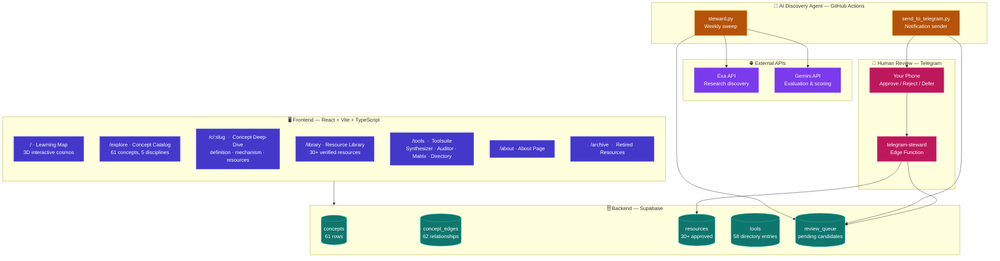
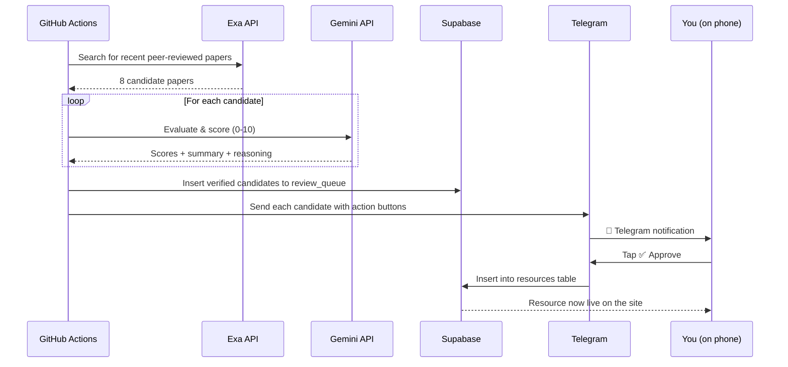
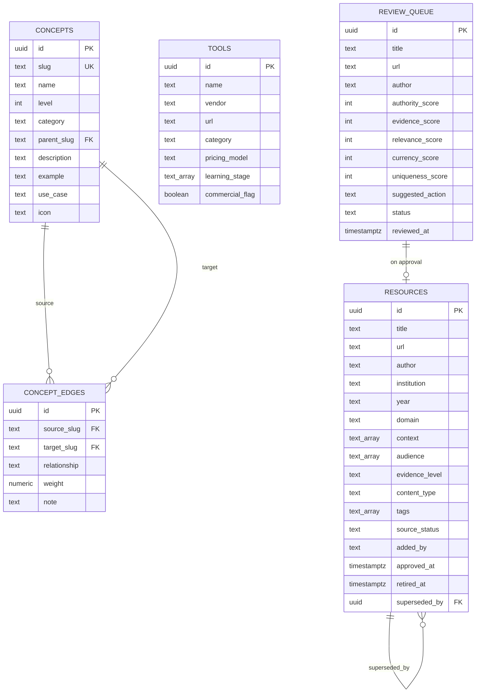
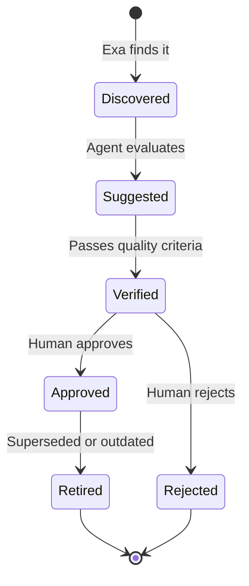

# The Learning Library

**A living atlas of learning.**

🔗 **Live:** [https://the-learning-library.ai.studio/](https://the-learning-library.ai.studio/)

---

## What This Is

The Learning Library is a curated, research-grounded platform for understanding how humans learn, teach, design, assess, coach, and develop.

It combines three things:

- **An interactive 3D map** of 61 concepts connected by 62 semantic relationships
- **A verified library** of research papers, academic textbooks, and frameworks
- **Practical tools** grounded in cognitive science and instructional design

Every resource in the library passes a six-criterion quality standard. Nothing enters without human review. Wikipedia is not a primary source.

---

## The Vision

The learning field produces thousands of papers, frameworks, and tools every year. No single curator can track it all. But quality matters more than quantity — a library is only as good as what it *excludes*.

This project exists to answer one question:

> *"I don't just want to know what something is. I want to understand why it exists, how it works, where it came from, how it affects people, how it is applied, what experts have learned, and how I can use that knowledge."*

**The goal is not a bigger library. The goal is a better one.**

---

## Architecture



---

## The Weekly Pipeline

Every Monday at 09:00 UTC, the entire pipeline runs automatically:



**The principle:** AI triages. Humans decide.

---

## Data Model



---

## The Quality Standard

Every resource must pass six criteria:

| Criterion | What It Means |
|---|---|
| **Authority** | Published by a recognized source |
| **Evidence** | Appropriate to its claims |
| **Relevance** | Fits the library charter |
| **Currency** | Not superseded |
| **Usefulness** | Helps someone learn or teach |
| **Diversity** | Adds a perspective or fills a gap |

### What Gets Included

- Peer-reviewed research and systematic reviews
- Academic textbooks and university publications
- University open educational resources
- Government and public-sector education research
- Professional association publications and standards
- Institutional reports from recognized research organizations
- Expert practitioner articles from recognized voices

### What Gets Excluded

- Wikipedia as a primary source
- Commercial content without independent credibility
- AI-generated content without human authorship
- SEO-optimized blog spam
- Content outside the meta-domain of learning
- Vendor product pages (these go in the Tools directory instead)

---

## The Five-Stage Lifecycle



Nothing enters the public library without human approval.

---

## Repository Structure

```
learning-library-steward/
├── steward.py                       # Weekly discovery agent
├── send_to_telegram.py              # Telegram notification sender
├── requirements.txt                 # Python dependencies
├── supabase_migration.sql           # Database schema + seed data
├── README.md                        # This file
├── SETUP.md                         # Setup instructions for forks
├── .github/
│   └── workflows/
│       └── weekly-sweep.yml         # GitHub Actions schedule
└── supabase/
    └── functions/
        └── telegram-steward/
            └── index.ts             # Webhook receiver for button taps
```

---

## The Charter

> Don't just collect knowledge. Discover, verify, evaluate, connect, curate, improve.
>
> The goal is not a bigger library. The goal is a better one.

---

## Contributing

This is currently a one-person project. If you'd like to contribute, reach out.

**Contact:** [indermanithapa1@gmail.com](mailto:indermanithapa1@gmail.com)

---

## Setup

See [SETUP.md](./SETUP.md) for full setup instructions if you're forking this project.

---

## Copyright

© 2026 Indermani Thapa. All rights reserved.

This repository is shared publicly for transparency and reference. The content, code, and data are not licensed for redistribution or commercial use without permission.

---

## Contact

**Maintained by** [Indermani Thapa](https://github.com/Indermanithapa)

📧 [indermanithapa1@gmail.com](mailto:indermanithapa1@gmail.com)
🔗 [https://the-learning-library.ai.studio/](https://the-learning-library.ai.studio/)

---

**Understand the landscape. Find the depth.**
